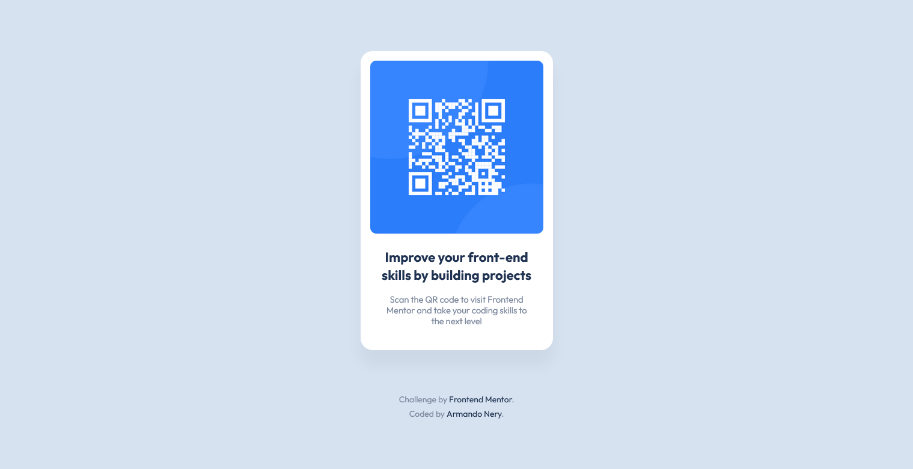
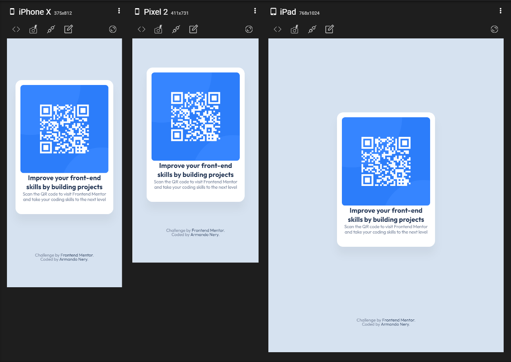

# Frontend Mentor - QR code component solution

This is a solution to the [QR code component challenge on Frontend Mentor](https://www.frontendmentor.io/challenges/qr-code-component-iux_sIO_H). Frontend Mentor challenges help you improve your coding skills by building realistic projects. 

## Table of contents

- [Overview](#overview)
  - [Screenshot](#screenshot)
  - [Links](#links)
- [My process](#my-process)
  - [Built with](#built-with)
  - [What I learned](#what-i-learned)
  - [Continued development](#continued-development)
  - [Useful resources](#useful-resources)
- [Author](#author)
- [Acknowledgments](#acknowledgments)

## Overview

QR code component

### Screenshot

Desktop version


Responsive


### Links

- Solution URL: [https://www.frontendmentor.io/solutions/qr-code-component-09j5HUVPF](https://your-solution-url.com)
- Live Site URL: [https://qr-code-component-three-iota.vercel.app/](https://your-live-site-url.com)

## My process
I really did follow along a youtube tutorial 

### Built with

- HTML5
- CSS custom properties
- Flexbox
- CSS Grids

### What I learned

I learned to use the BEM methodology:
```html
<div class="card__text">
    <h2 class="card__heading">Improve your front-end skills by building projects</h2>
    <p class="card__detail">Scan the QR code to visit Frontend Mentor and take your coding skills to the next level
    </p>
</div>
```

The is() function: 
```css
.attribution__link:is(:hover, :focus-within)
```

And :focus-within
```css
.attribution__link:is(:hover, :focus-within) {
    color: rgb(34, 195, 191);
}
```

### Continued development

The terms I'd love to use and remember more on most projects are:
- BEM
- CSS functions 

### Useful resources

- [Example resource 1](https://www.youtube.com/watch?v=kdmeiXWRxcY) - This helped me because the tutorial was easy to follow along and well explaines.

## Author

- Website - [Armando Nery](https://armandonery.vercel.app/)
- Frontend Mentor - [@armandonery](https://www.frontendmentor.io/profile/armandonery)

## Acknowledgments

Thanks to Grizhlie Codes https://www.youtube.com/channel/UCB9_0WlcIp8QWGZTl4nf5bg for the tutorial.